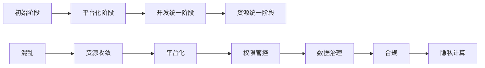

# 大数据开发思路

## 目标

* 整理大数据开发思路
* 整理大数据开发工具思路

## 详细步骤

### 大数据产品演进过程



### 整体架构

```mermaid
graph 

```


### 数据中台演进过程

1. 数据库阶段 ，增删改查
2.  数据仓库阶段，支持复杂的查询、报表分析用户价值分析等
3.  数据平台阶段，计算自由，建立计算平台，执行各种实时、离线任务
4.  数据中台阶段，全域级，可复用的数据资产及数据能力


## 参考文献

* mermaid js： https://github.com/mermaid-js/mermaid
* mermaid 样例：https://mermaid.js.org/syntax/flowchart.html

